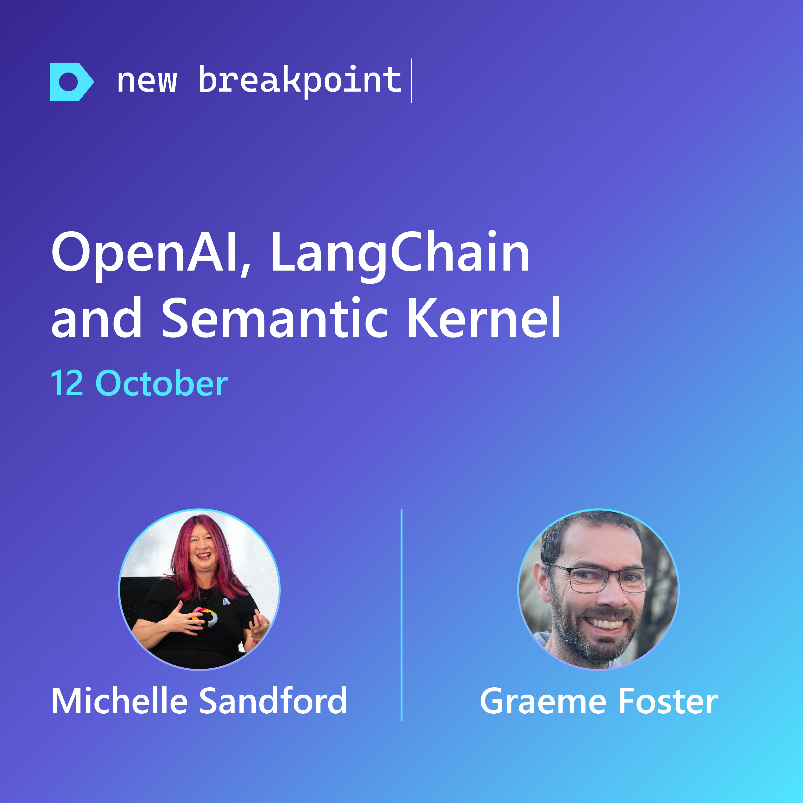
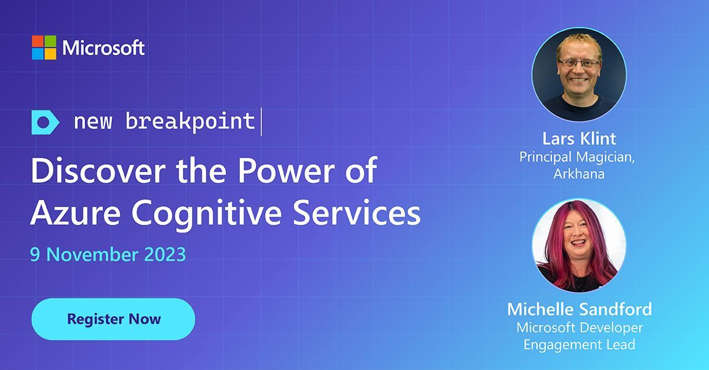
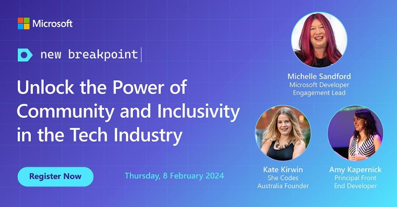
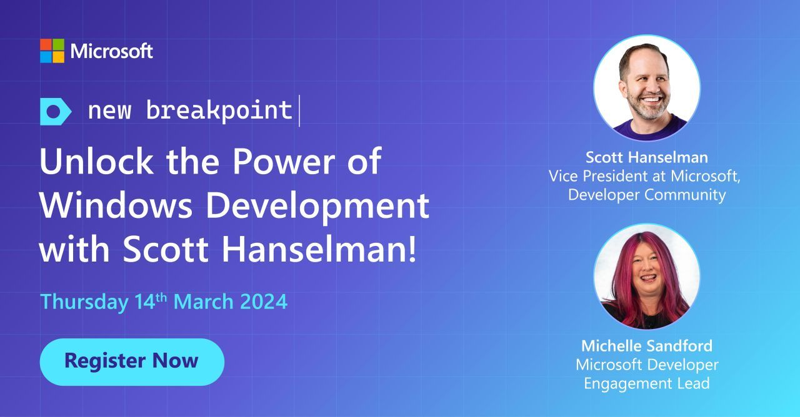
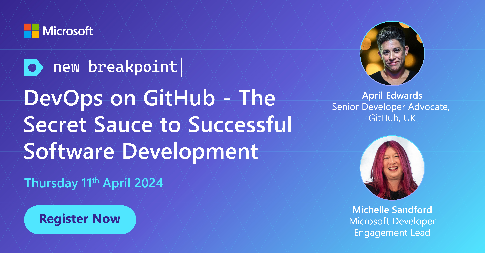

New Breakpoint is a regular online show for Australian and New Zealand developers produced by local developers at Microsoft and in the community.

This repository hosts useful follow ups, links and other information from each episode.

We want everyone who comes along to feel welcome and safe. Please make sure to review our [Code of Conduct](https://learn.microsoft.com/legal/learnevents/codeofconduct) before joining in and contributing to our discussion.

You can watch all our episodes via playlists on Microsoft ANZ's YouTube Channel - [Season 1](https://aka.ms/new-breakpoint/s1) | [Season 2](https://aka.ms/new-breakpoint/s2).

Or register to view the sessions on-demand through our [New Breakpoint Webpage](https://info.microsoft.com/AU-DevEngage-CATALOG-FY22-08Aug-18-New-Breakpoint-SRDEM82686_Catalog-Display-Page.html)

We would like to acknowledge that we record the show on the traditional lands of the Gadigal people of the Eora nation, and have guests from around Australia who join us from the traditional lands of their local people. We pay our respects to Elders past, present and future.

Season 3 starting soon kicked off September 2023. You can find episodes 1 and 2 via the on-demand [Season 3](https://aka.ms/newbreakpoint3) registration link

[Season 1](https://github.com/ANZAzureDevs/New-Breakpoint/blob/main/series-01.md)
[Season 2](https://github.com/ANZAzureDevs/New-Breakpoint/blob/main/series-02.md)

***

## 2023-09-14: GitHub - Revolutionising the Developer Experience with Mish Mannering

You can catch this episode on our [YouTube Channel](https://aka.ms/new-breakpoint/s3). 

In this episode Microsoft Developer Engagement Lead and host, [Michelle Sandford](https://www.linkedin.com/in/michellesandford/) is joined by GitHub Developer Advocate [Mish Mannering](https://www.linkedin.com/in/mishmanners/) to get the latest hot-off the press updates on developer research at GitHub, CoPilot usage, prompt engineering, what’s off the waitlist now and what you can use as well as a bunch of other super cool things. 
Mish Mannering will also explore: 

•	The latest projects from the team of researchers and engineers at GitHub Next.
•	More details on GitHub Copilot Chat: Real-Time Collaboration with your AI.
•	News of the latest updates on the feature GitHub projects.
•	What prompt engineering is and how developers use it to design prompting techniques that interface with large language models and other tools.
•	New unveilings with GitHub Release Radar and GitHub Game Bytes. 

Mish showed off some awesome [GitHub](https://github.com/) demos and content, here are some good links:

- [GitHub Release Radar](https://github.blog/2023-08-15-release-radar-jul-23/)
- [GitHub GameBytes](https://github.blog/2023-07-25-game-bytes-july-2023/)
- [A developer’s guide to prompt engineering and LLMs](https://github.blog/2023-07-17-prompt-engineering-guide-generative-ai-llms/)
- [What developers need to know about generative AI](https://github.blog/2023-04-07-what-developers-need-to-know-about-generative-ai/)
- [How to use GitHub Copilot: Prompts, tips, and use cases](https://github.blog/2023-06-20-how-to-write-better-prompts-for-github-copilot/)
- [The GitHub Blog](https://github.blog/)
- [Research: quantifying GitHub Copilot’s impact on developer productivity and happiness](https://github.blog/2022-09-07-research-quantifying-github-copilots-impact-on-developer-productivity-and-happiness/)
- [Research: How GitHub Copilot helps improve developer productivity](https://github.blog/2022-07-14-research-how-github-copilot-helps-improve-developer-productivity/)
- [GitHub Copilot X: The AI-powered developer experience](https://github.blog/2023-03-22-github-copilot-x-the-ai-powered-developer-experience/)

If you enjoyed the episode and want more content like it? Try our monthly developer newsletter: https://aka.ms/DevNewsletterJoin

***

## 2023-10-12: Demystifying OpenAI and GPT with Graeme Foster

You can catch this episode on our [YouTube Channel](https://aka.ms/new-breakpoint/s3). 

Welcome to the second episode of New Breakpoint Season 3, where we're separating the hype from the actual use cases of OpenAI and GPT. They look, sound and function like magic, but are conceptually quite simple. But how do we cut through the hype to get to the code?
In this episode Microsoft Developer Engagement Lead and host [Michelle Sandford](https://www.linkedin.com/in/michellesandford/) will talk to Technical Specialist [Graeme Foster](https://www.linkedin.com/in/graeme-foster-a23a14/) as he walks through what they are and how they work by building one for you from raw ingredients including Azure OpenAI, Cognitive Search, and a database. 

There’s going to be code, code and more code with a grand finale that errs on the side of unexplainable black magic! Sit back, grab some popcorn, and enjoy the mysterious world of large language models.
Graeme will discuss: 
•	His personal journey on how he cut through the hype to get straight to the code and his tips and tricks on what to avoid and what to focus on
•	How to rethink what’s possible with OpenAI by demonstrating shortcuts that will broaden your horizons. 
•	A demonstration of GPT, LangChain, and Semantic Kernel and how they work by building one for you from raw ingredients including Azure OpenAI

Graeme showed off some awesome code demos and content, here are some good links:

- [Semantic Kernel](https://learn.microsoft.com/en-us/semantic-kernel/overview/)
- [Integrate with LangChain](https://learn.microsoft.com/en-us/azure/machine-learning/prompt-flow/how-to-integrate-with-langchain?view=azureml-api-2)
- [Azure Cognitive Search and LangChain: A Seamless Integration for Enhanced Vector Search Capabilities](https://techcommunity.microsoft.com/t5/azure-ai-services-blog/azure-cognitive-search-and-langchain-a-seamless-integration-for/ba-p/3901448)
- [Build language model pipelines with memory](https://learn.microsoft.com/en-us/azure/architecture/guide/ai/language-model-pipelines)
- [Generative AI Learning Paths](https://learn.microsoft.com/en-us/users/techgirlwa/collections/3o36updx3jmg75)
- [Build your own Langchain](https://github.com/graemefoster/buildyourownlangchain)

## 2023-11-09: Discover the Power of Azure Cognitive Services with Lars Klint

You can catch this episode on our [YouTube Channel](https://aka.ms/new-breakpoint/s3). 

Azure Cognitive Services brings a host of benefits that revolutionise the way we approach problems. A catalyst for career advancement, Azure can also be a source of fun.

In this episode of our New Breakpoint Series, Microsoft Developer Engagement Lead and host Michelle Sandford talks to Principal Consultant at Arkahna, Lars Klint. Lars will delve into Azure Cognitive Services and talk to how it has not only enhanced his farm management but also developed his skills and career. He will show us the potential of Azure, transforming hobbies into lucrative ventures.

Lars will discuss:

The unexpected synergy between llamas and AI, illustrating the power and reach of modern technology.
The transformative potential of hobby projects in your professional journey, demonstrating how personal interests can evolve into career-advancing opportunities.
How leveraging AI can help upskill and progress your career, emphasising the role of Azure Cognitive Services in this evolution.
The most interesting Open AI Projects Lars is actively involved with at Arkahna.

[Register to watch on-demand](https://mktoevents.com/Microsoft+Event/413065/157-GQE-382?ocid=lp_pg292429_gdc_comm_mw)

- [Create Custom Vision Resources](https://learn.microsoft.com/en-us/training/paths/create-computer-vision-solutions-azure-cognitive-services/)
- [Create Azure Static Web Apps](https://learn.microsoft.com/en-us/training/paths/azure-static-web-apps/)
- [Azure Live Streaming Best Practices](https://learn.microsoft.com/en-us/azure/media-services/latest/live-event-streaming-best-practices-guide)
- [Azure in Action Book](https://www.manning.com/books/microsoft-azure-in-action)
- [Lars Klint on YouTube](https://www.youtube.com/@LarsKlintTech)
- [Arkahna](https://arkahna.io/)
- [Microsoft Responsible AI](https://www.microsoft.com/en-us/ai/responsible-ai)
- [Azure Media Services Retirement Guide](https://learn.microsoft.com/en-us/azure/media-services/latest/azure-media-services-retirement)

If you enjoyed the episode and want more content like it? Try our monthly developer newsletter: [Microsoft Source](https://aka.ms/DevNewsletterJoin)
***

## 2024-02-08: Unlock the Power of Community and Inclusivity in the Tech Industry

Be inspired by the empowering journeys of WA Young Australian of the Year and She Codes Australia Founder Kate Kirwin and International Keynote Speaker and Principal FrontEnd Web #Developer Amy Kapernick
 
Join our Microsoft Developer Engagement Lead Michelle Sandford to discover how these remarkable individuals are building #inclusive #communities and making a significant impact in the #tech industry.
 
(Watch on-demand)[https://mktoevents.com/Microsoft+Event/420573/157-GQE-382]

### Episode Resources:
- [She Codes](https://shecodes.com.au)
- [DDDPerth]([https://www.microsoft.com/en-us/ai/responsible-ai](https://dddperth.com/))
- [NDC Conferences](https://ndcconferences.com/)
- [YOW!Conferences](https://yowcon.com/)

If you enjoyed the episode and want more content like it? Try our monthly developer newsletter: [Microsoft Source](https://aka.ms/DevNewsletterJoin)

***

## 2024-03-14: Elevate your Windows development experience 📈 with Scott Hanselman

Join one of the industry's foremost experts, Scott Hanselman, as he explores the latest tools and techniques in an exclusive episode of New Breakpoint.

We will cover:
✅ The art of terminal customisation
✅ The hidden gems of PowerToys 
✅ Integrating Visual Studio (VS) and Visual Studio Code (VS Code) 
✅ Harnessing Azure Developer CLI capabilities
✅ The powerful trio of Playwright, Docker, and command-line competence
✅ The features and capabilities of DevBox

Register to watch on demand: [On demand](https://msevents.microsoft.com/event?id=3268704800)

### Episode Resources:
- [Scott Hanselman's Blog](http://hanselman.com)
- [Hanselminutes Podcast](hanselminutes.com)
- [Azure Friday](azurefriday.com)

If you enjoyed the episode and want more content like it? Try our monthly developer newsletter: [Microsoft Source](https://aka.ms/DevNewsletterJoin)

#MicrosoftAustralia #MicrosoftNZ #MSDeveloperANZ #NewBreakpoint

***

## 2024-03-14: DevOps on GitHub: The Secret Sauce to Successful Software Development with April Edwards

Join one of alumni from The League of Extraordinary Advocates, April Edwards, as she explores the secret sauce of DevOps.

We will cover:
✅ What is Devops
✅ Shifting Left
✅ High Performing DevOps
✅ Secure Software Development
✅ GitHub Azure Integration
✅ Security in the Development Lifecycle
✅ Collaboration
✅ Demo in GitHub Codespaces
✅ Automating Pull Requests
✅ Code scanning
✅ Traceability
✅ Test environments

Register to watch on demand: [On demand](https://msevents.microsoft.com/event?id=3268704800)

### Episode Resources:
- [GitHub Learning](https://learn.microsoft.com/training/github)
- [GitHub Certifications](https://gh.io/gh-certs-guide)
- [15 Minutes to Merge on GitHub](https://gh.io/15MinutesToMerge)

If you enjoyed the episode and want more content like it? Try our monthly developer newsletter: [Microsoft Source](https://aka.ms/DevNewsletterJoin)

#MicrosoftAustralia #MicrosoftNZ #MSDeveloperANZ #NewBreakpoint #DevOps #DevSecOps #Azure #GitHub
