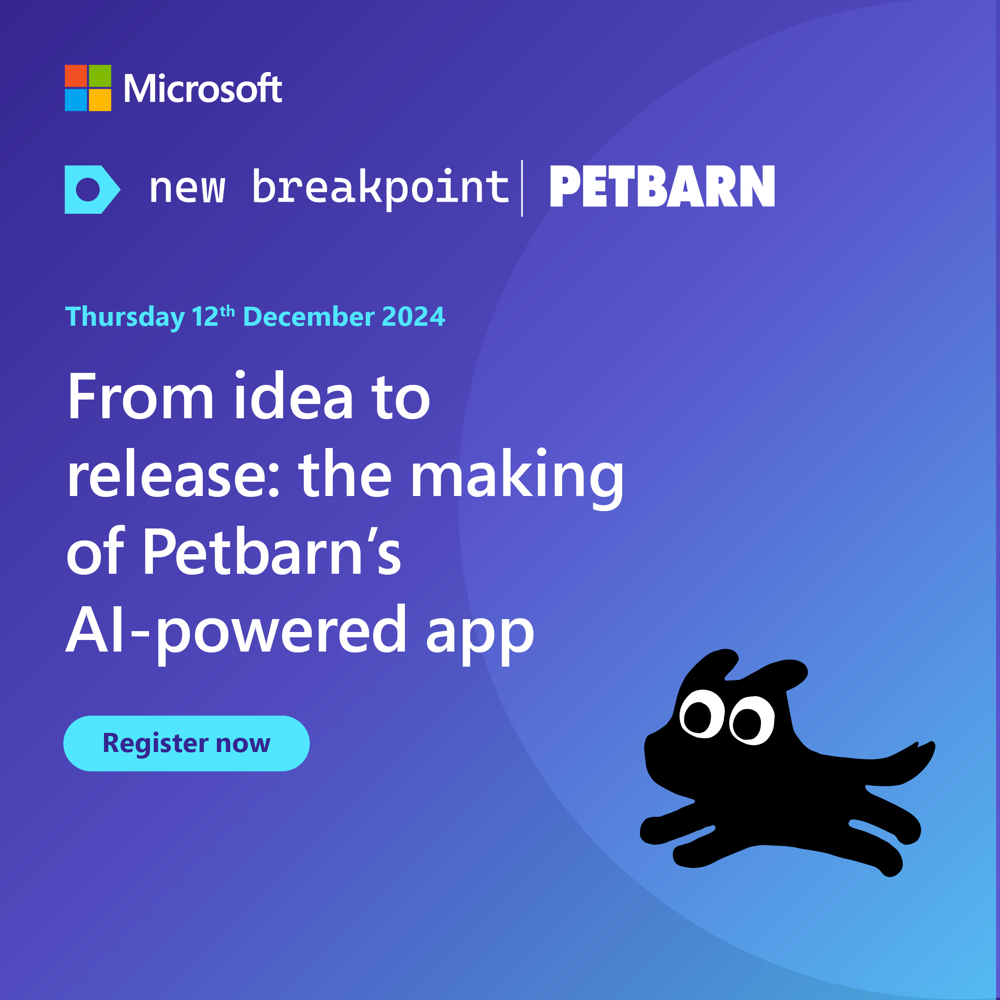

New Breakpoint is a regular online show for Australian, Asian and New Zealand developers produced by local developers at Microsoft and in the community.

This repository hosts useful follow ups, links and other information from each episode.

We want everyone who comes along to feel welcome and safe. Please make sure to review our [Code of Conduct](https://learn.microsoft.com/legal/learnevents/codeofconduct) before joining in and contributing to our discussion.

You can watch all our episodes via playlists on Microsoft ANZ's YouTube Channel - [Season 1](https://aka.ms/new-breakpoint/s1) | [Season 2](https://aka.ms/new-breakpoint/s2) | [Season 3](https://aka.ms/new-breakpoint/s3) 

You can register to view the current season on-demand through our [New Breakpoint Webpage](https://info.microsoft.com/AA-DevOps-CNTNTO-FY25-01Jan-24-New-Breakpoint-SREVM60480_Catalog-Display-Page.html)

We would like to acknowledge that we record the show on the traditional lands of the Gadigal people of the Eora nation, and have guests from around Australia who join us from the traditional lands of their local people. We pay our respects to Elders past, present and future.

Season 4 kicked off July 2024. You can access it via the on-demand [Season 4](https://aka.ms/new-breakpoint) registration link

- [Season 1](https://github.com/ANZAzureDevs/New-Breakpoint/blob/main/series-01.md)
- [Season 2](https://github.com/ANZAzureDevs/New-Breakpoint/blob/main/series-02.md)
- [Season 3](https://github.com/ANZAzureDevs/New-Breakpoint/blob/main/series-03.md)

***

## 2024-07-11: New Breakpoint S4 Ep 1: Fireside chat with Scott Hunter on .NET Aspire

Join Microsoft Developer Engagement Lead, Michelle Sandford as she chats to Scott Hunter, VP of Product for the Azure Developer Experience Team at Microsoft and learn how this new framework transforms .NET into a modern cloud native framework adding support for Observability, Resiliency, Scalability and Manageability. 

We will cover:

✅ Developer-Centric Insights: Gain valuable insights from Scott Hunter of the Azure developer experience team, as he shares his journey and the evolution of Azure's developer tools and services.

✅ Aspire Framework Introduction: Discover Aspire, the new cloud-native framework for .NET that simplifies the developer experience with built-in defaults for resiliency, health checks, and telemetry. 

✅ Seamless Cloud Transition: Learn how Aspire enables a smooth transition for large enterprise applications to the cloud, enhancing existing features and providing a clear path forward for developers. 

✅ Codespace and GitHub Copilot: Understand how Aspire seamlessly integrates with containers and AI to take away all your complications and speed your developer journey. 

Register to watch on demand: [On demand](https://msevents.microsoft.com/event?id=2397856278)

### Episode Resources:
- [.NET ASPIRE Overview](https://learn.microsoft.com/en-us/dotnet/aspire/get-started/aspire-overview)
- [Introduction to .NET ASPIRE](https://learn.microsoft.com/en-us/training/modules/introduction-dotnet-aspire/)
- [Build Distributed Apps with .NET ASPIRE](https://learn.microsoft.com/en-gb/training/paths/dotnet-aspire/)
- [Tooling to generate AWS deploys from the manifest](https://www.nuget.org/packages/Aspire.Hosting.AWS)
- [code samples using Aspire with OPenAI/Copilot](https://learn.microsoft.com/en-us/dotnet/aspire/azureai/azureai-search-document-component?tabs=dotnet-cli)
- [Add .NET Aspire to an existing .NET App](https://learn.microsoft.com/en-us/dotnet/aspire/get-started/add-aspire-existing-app?tabs=unix&pivots=visual-studio)

If you enjoyed the episode and want more content like it? Try our monthly developer newsletter: [Microsoft Source](https://aka.ms/DevNewsletterJoin)

#MicrosoftAustralia #MicrosoftNZ #MSDeveloperANZ #NewBreakpoint #DevOps #DevSecOps #Azure #GitHub

***

## 2024-08-08: New Breakpoint S4 Ep 2: Simplify cloud-native app deployment and scaling with AKS

Join our host Michelle Sandford, Developer Engagement Lead, as she delves into Azure Kubernetes Service (AKS) with Manoj Ravikumar Nair, Microsoft Azure App Innovation Specialist.

Manoj will show how you can use AKS features to simplify app deployment and automatically scale your applications.

This session is your gateway to building resilient, manageable and scalable cloud-native applications. Discover how AKS facilitates the hosting of cloud-native applications and learn how to package and release your applications seamlessly.

We will cover:

✅ Fundamentals of Kubernetes, AKS and Azure Container Registry (ACR)

✅ Deploying applications using Kubernetes Constructs and the Application Routing add-on

✅ Implementing application updates and rollback strategies 

✅ Scaling applications manually or automatically with Horizontal Pod Autoscaler (HPA) and Vertical Pod Autoscaler (VPA)

Register to watch on demand: [On demand](https://msevents.microsoft.com/event?id=526822164)

### Episode Resources:
- [Learn about Azure Kubernetes Service](https://learn.microsoft.com/en-gb/azure/aks/)
- [Develop on Azure Kubernetes Service (AKS) with Helm](https://learn.microsoft.com/en-us/azure/aks/quickstart-helm?tabs=azure-cli)
- [Cluster operator and developer best practices to build and manage applications on Azure Kubernetes Service (AKS)](https://learn.microsoft.com/en-us/azure/aks/best-practices)
- [Use the cluster autoscaler in Azure Kubernetes Service (AKS)](https://learn.microsoft.com/en-us/azure/aks/cluster-autoscaler?tabs=azure-cli)
- [Upgrade an Azure Kubernetes Service (AKS) cluster](https://learn.microsoft.com/en-us/azure/aks/tutorial-kubernetes-upgrade-cluster?tabs=azure-cli)
- [Episode Q&A](qanda/S04E02LiveQandA.md)

If you enjoyed the episode and want more content like it? Try our monthly developer newsletter: [Microsoft Source](https://aka.ms/DevNewsletterJoin)

#MicrosoftAustralia #MicrosoftNZ #MSDeveloperANZ #NewBreakpoint #DevOps #DevSecOps #Azure #GitHub

***

## 2024-12-09: New Breakpoint S4 Ep3 Code green: the intersection of software engineering and sustainability

Join host Michelle Sandford, Developer Engagement Lead, as she investigates the emerging discipline of green software engineering with Sara Bergman, Senior Software Engineer at Microsoft Norway. 
Sara is an advocate for green software practices, in her role at Microsoft as well as through contributions to the Green Software Foundation and as co-author of the book Building Green Software. 

This episode highlights the importance of considering the environmental impact of software and how you can take steps to mitigate it through green software practices and sustainable development strategies. It provides insights into the intersection of software engineering and sustainability, along with practical tips to get you started:

✅ How you can contribute to green software initiatives within your organisation and community.

✅ The impact of software on hardware requirements and the importance of energy and hardware efficiency.

✅ Practical steps software engineers can take in their work to design and build software with sustainability in mind.

✅ How to engage in advocacy, education and thoughtful design as a practitioner of green software development.

Register to watch on demand: [On demand](https://msevents.microsoft.com/event?id=4006170917)

### Episode Resources:
- [Green Software Foundation](https://greensoftware.foundation/)
- [Green Software Foundation GitHub Page](https://github.com/Green-Software-Foundation)
- [Sustainability from the datacenter to the cloud with Azure](https://www.microsoft.com/en-us/sustainability/azure)
- [Well architected framework - Sustainable Workloads](https://learn.microsoft.com/en-us/azure/well-architected/sustainability/sustainability-get-started)
- [How to architect software for a greener future](https://www.infoq.com/articles/architect-software-for-greener-future/)
- [Building Green Software O'Reilly Book](https://www.oreilly.com/library/view/building-green-software/9781098150617/)

If you enjoyed the episode and want more content like it? Try our monthly developer newsletter: [Microsoft Source](https://aka.ms/DevNewsletterJoin)

#MicrosoftAustralia #MicrosoftNZ #MSDeveloperANZ #NewBreakpoint #GreenSoftware #Sustainability #Azure #Rust

## 2024-10-10: New Breakpoint S4 Ep4 Scale smarter with AI-Sentry, a game-change for enterprise genAI

In this episode, we dive under the hood of Microsoft’s open-sourced solution that helps enterprises scale their generative AI implementations. Microsoft AI Technical Specialist Rivaaj Jumna and Cloud Solution Architect Arian Nevjestic will demonstration how AI-Sentry is a game-changer for enterprises looking to securely scale genAI.

✅ Configuration and setup of AI-Sentry

✅ Scaling AI for Enterprise

Register to watch on demand: [On demand](https://msevents.microsoft.com/event?id=4006170917)

### Episode Resources:
- [AI Sentry](https://github.com/microsoft/ai-sentry)
- [GenAI Gateway](https://learn.microsoft.com/en-us/ai/playbook/technology-guidance/generative-ai/dev-starters/genai-gateway/)
- [APIM Management](https://learn.microsoft.com/en-us/azure/api-management/)

If you enjoyed the episode and want more content like it? Try our monthly developer newsletter: [Microsoft Source](https://aka.ms/DevNewsletterJoin)

#MicrosoftAustralia #MicrosoftNZ #MSDeveloperANZ #NewBreakpoint #Security #python #Azure #dotNET

## 2024-11-14: New Breakpoint S4 Ep5 SBeyond BaseRAG: using GraphRAG to get more from your GPT

In this episode of New Breakpoint, Michelle Sandford and Graeme Foster delve deep into the world of RAG. Retrieval augmented generation (RAG) has emerged as a powerful technique for enhancing the capabilities of large language models (LLMs). By combining the strengths of traditional retrieval methods with the generative power of LLMs, RAG enables models to access and incorporate relevant information from external sources, leading to more accurate, informative and contextually relevant responses. But it has presented limitations.

Enter GraphRAG. Join us for a live demonstration of the transformative potential of GraphRAG. Witness its capabilities, learn how it can be applied to various use cases and discover the practical steps to implement this groundbreaking technology in your own projects.

Don’t miss this opportunity to learn:

✅	The challenges and limits of traditional RAG.

✅	The power of knowledge graphs

✅	How GraphRAG leverages knowledge graphs to better understand the relationships between entities in a document, enhancing LLM responses.

✅	How to get started with GraphRAG using the Microsoft SDK.

Whether you’re a seasoned developer or just starting out, this episode will equip you with the knowledge and tools to unlock the full potential of GraphRAG.

Graeme will present insightful examples of how GraphRAG works taking you through its core building blocks. He’ll also provide an overview of the Microsoft SDK that makes it easier to implement GraphRAG.
With pointers to additional resources and research, this engaging episode will get you off and running with a sound understanding of how to implement GraphRAG and what it can help your organisation achieve.

Register to watch on demand: [On demand](https://aka.ma/New-Breakpoint)

### Episode Resources:
- [Microsoft GraphRAG Blog](https://www.microsoft.com/en-us/research/blog/graphrag-unlocking-llm-discovery-on-narrative-private-data/?msockid=04eae7ff00416f3535a2f521011c6eb4)
- [Microsoft GraphRAG on GitHub](https://github.com/microsoft/graphrag)
- [GraphRAG Docs](https://microsoft.github.io/graphrag/)
- [Microsoft GraphRAG Accelerator](https://github.com/Azure-Samples/graphrag-accelerator)
- [Graeme Fosters GraphRAG Demo Repo](https://github.com/graemefoster/newbreakpoint-graphrag)

If you enjoyed the episode and want more content like it? Try our monthly developer newsletter: [Microsoft Source](https://aka.ms/DevNewsletterJoin)

#MicrosoftAustralia #MicrosoftNZ #MSDeveloperANZ #NewBreakpoint #GenAI #GraphRAG #Azure #Python

## 2024-11-14: New Breakpoint S4 Ep6 Discover the exciting pawsibilities of PetAI – Petbarn’s new intelligent pet parent assistant

In this episode, Michelle Sandford hosts a stellar panel who will delve into the birth of Petbarn's revolutionary AI-powered application. From the initial concept and Microsoft envisioning workshops to launch, explore the learnings derived from this innovative journey.
 
This episode promises valuable tips along with a demo showcasing the future of AI within apps. Our expert guest panel is made up of Rory Watt, GM of Enterprise Product & Program for Greencross/Petbarn, Veli-Matti Vanamo from Insight and Jason Leong from Microsoft.
 
Highlights include:

✅ The inspiration behind Petbarn’s AI-powered app and what it will deliver for the business.

✅ A deep dive into the proof-of-concept phase.

✅ The technical build of the Petbarn app, highlighting crucial features and development challenges, the implementation and launch strategy, testing and learning, along with future scaling plans using Azure OpenAI to establish architecture for a multi-agent framework.

✅ How your organisation can get involved with a Microsoft envisioning workshop.

Don’t miss this episode that will bring you a practical vision for implementing and scaling in-app agent.

Register to watch on demand: [Live Event](https://aka.ma/New-Breakpoint)
Episode will appear on the Microsoft ANZ channel a few days after the event [New Breakpoint Season 4 on YouTube](https://youtube.com/playlist?list=PLz6RgUKX11CVjx1W8H_p3bnP90k2i7mBN&si=HjSM5VDO5cHlfZdk)

### Episode Resources:
- [Build AI Enabled Agents](https://learn.microsoft.com/en-us/azure/cosmos-db/ai-agents)
- [Build Generative AI Solutions](https://learn.microsoft.com/en-us/azure/developer/ai/introduction-build-generative-ai-solutions)
- [Develop AI Solutions with Azure OpenAI](https://learn.microsoft.com/en-us/training/paths/develop-ai-solutions-azure-openai/)
- [Step by Step guide to develop AI Multi-Agent system using Microsoft Semantic Kernel and GPT-4o](https://devblogs.microsoft.com/semantic-kernel/step-by-step-guide-to-develop-ai-multi-agent-system-using-microsoft-semantic-kernel-and-gpt-4o/)
- [RAG Chat App with Azure AI Search](https://github.com/Azure-Samples/azure-search-openai-demo)
- [Check out PetBarn Pet.AI on the website](https://www.petbarn.com.au/?gclid=ab3fb1f040aa178d14a8d6aa6967760a&utm_adgroupid=1143493776815590&msclkid=ab3fb1f040aa178d14a8d6aa6967760a&utm_source=bing&utm_medium=cpc&utm_campaign=Sparro%20%7C%20S%20%7C%20Petbarn%20Brand%20%7C%20Pure%20(new)&utm_term=petbarn&utm_content=Brand%20%7C%20Exact%20%7C%20Petbarn%20%7C%20Root)
- [PetBarn Pet.ai app available in the Apple and Play store](https://www.petbarn.com.au/app?link=black_bar)

If you enjoyed the episode and want more content like it? Try our monthly developer newsletter: [Microsoft Source](https://aka.ms/DevNewsletterJoin)

#MicrosoftAustralia #MicrosoftNZ #MSDeveloperANZ #NewBreakpoint #GenAI #Azure

## 2025-02-14: New Breakpoint S4 Ep7 Embracing Developer Choice with GitHub’s Damian Brady

This month's New Breakpoint episode with my special guest Damian Brady from GitHub on 13th Feb is a good way to keep up to date with all things GitHub Copilot

Excitingly, we are broadcasting across Asia for the first time, airing at the following times:
⌚ 9:00 AM - 10:00 AM (GMT +5:30) India
⏰ 11:30 AM - 12:30 PM (GMT +8) Singapore
⏲️ 4:30 PM - 5:30 PM (GMT+13:00) Auckland

We will talk about how GitHub is embracing developer choice with Multi-Model Copilot, New App creation Tool GitHub Spark, and the AI-Native Developer Experience. From advancements to GitHub Copilot in VSCode to the next iteration of Copilot Workspace and GitHub Models, Damian will walk us through the AI-native and agentic developer experience powered by developer choice and control. 

Don’t miss this opportunity to learn more about:
✅ Multi-model GitHub Copilot
⚡ GitHub Spark
🧷 Copilot Autofix and security campaigns to fix vulnerabilities at scale
🌻 Copilot Workspace

### Episode Resources:

- [GitHub Copilot: The agent awakens](https://github.blog/news-insights/product-news/github-copilot-the-agent-awakens/)
- [Developer use cases for AI with GitHub Copilot](https://learn.microsoft.com/en-us/training/modules/developer-use-cases-for-ai-with-github-copilot/)
- [5 tips and tricks when using GitHub Copilot Workspace](https://github.blog/ai-and-ml/github-copilot/5-tips-and-tricks-when-using-github-copilot-workspace/)
- [Multi-file editing, code review, custom instructions, and more](https://github.blog/changelog/2024-10-29-multi-file-editing-code-review-custom-instructions-and-more-for-github-copilot-in-vs-code-october-release-v0-22/)
- [GitHub Changelog - stay updated on all the new features](https://github.blog/changelog/)
- [GitHub Copilot Blog](https://github.blog/ai-and-ml/github-copilot/)
- [GitHub Spark](https://githubnext.com/projects/github-spark
- [GitHub Spark User Manual](https://github.com/githubnext/github-spark-user-manual)

If you enjoyed the episode and want more content like it? Try our monthly developer newsletter: [Microsoft Source](https://aka.ms/DevNewsletterJoin)

#MicrosoftAustralia #MicrosoftNZ #MSDeveloperANZ #NewBreakpoint #Productivity #Azure #GitHub

## 2025-03-13: New Breakpoint S4 Ep8 Let Bicep do the heavy lifting for AI services to Azure

This month's New Breakpoint episode with my special guest Melissa Houghton from MakerX on 13th March is a good way to keep up to date with all things Bicep

Excitingly, we are broadcasting across Asia for the first time, airing at the following times:
⌚ 9:00 AM - 10:00 AM (GMT +5:30) India
⏰ 11:30 AM - 12:30 PM (GMT +8) Singapore
⏲️ 4:30 PM - 5:30 PM (GMT+13:00) Auckland

Developers, get ready to level up your Azure deployment skills with Bicep! Join us for an insightful session where Melissa Houghton, Microsoft MVP in Developer Technologies, teams up with our host Michelle Sandford to share her expertise on how Bicep can save you time and reduce stress. With its templated and reusable components and modules, Bicep enables repeatable, standardized deployment of your code and resources. 

In this episode, Melissa will guide you through deploying AI services to Azure using Bicep. She’ll also help you troubleshoot any challenges you might encounter. With Melissa's step-by-step demos, you'll quickly build your deployment muscle. 

Tune in for this on-screen demo of AI services provisioning with Bicep – from go to whoa. 

Plus, you can ask Melissa questions live! Find out exactly what you need to know about Bicep and Azure AI deployment. It’s your chance to get tips and fixes that will save you time and your sanity. You’re welcome! 

### Episode Resources:

- [What is Bicep](https://aka.ms/azfr/734/01 )
- [Create an Azure AI Services Resource using Bicep](https://learn.microsoft.com/en-us/azure/ai-services/create-account-bicep?tabs=CLI)
- [Azure / bicep on GitHub](https://aka.ms/azfr/734/02)
- [Frequently asked questions for Bicep](https://aka.ms/azfr/734/04 )
- [Simple FastAPI AZD Template](https://github.com/Azure-Samples/azd-simple-fastapi-appservice)
- [Simple Flask AZD Template](https://github.com/Azure-Samples/azd-simple-flask-appservice)
- [Use Bicep to deploy your Azure](https://www.youtube.com/playlist?list=PLlrxD0HtieHjzqIRjPoERUGj49rve3rCM)
- [Tips for writing Bicep Files for Azure Deployment](https://blog.pamelafox.org/2023/01/tips-for-writing-bicep-files-for-azure.html)

If you enjoyed the episode and want more content like it? Try our monthly developer newsletter: [Microsoft Source](https://aka.ms/DevNewsletterJoin)

#MicrosoftAustralia #MicrosoftNZ #MSDeveloperANZ #NewBreakpoint #Productivity #Azure #GitHub

## 2025-04-10: Explore the Power of GitHub Actions with Haimantika Mitra

This month's New Breakpoint episode with my special guest Haimantika Mitra from Digital Ocean on 10th April is a good way to keep up to date with all things GitHub Actions

Excitingly, we are broadcasting across Asia for the first time, airing at the following times:
⌚ 9:00 AM - 10:00 AM (GMT +5:30) India
⏰ 11:30 AM - 12:30 PM (GMT +8) Singapore
⏲️ 4:30 PM - 5:30 PM (GMT+13:00) Auckland

Keen to get in on the action? Microsoft MVP Haimantika Mitra is going to supercharge your workflows and opportunities with GitHub Actions and open-source contributions. 

The next episode of New Breakpoint is your go-to guide to GitHub Actions, getting the most from open-source communities and how to ace Hacktoberfest for the biggest career boost. 

And we’ll demo how to build your own AI to write up your technical documentation.

### Episode Resources:

- [Building an AI Article Reviewer using GenAI Platform and GitHub](https://www.digitalocean.com/community/tutorials/ai-article-reviewer-genai-platform-github)
- [Create an Azure AI Services Resource using Bicep](https://learn.microsoft.com/en-us/azure/ai-services/create-account-bicep?tabs=CLI)
- [Automate your workflow with GitHub Actions](https://learn.microsoft.com/en-us/training/paths/github-actions/)
- [Introduction to GitHub Actions](https://learn.microsoft.com/en-us/training/modules/introduction-to-github-actions/)
- [GitHub Actions Certification Learning Path](https://learn.microsoft.com/en-us/collections/n5p4a5z7keznp5?WT.mc_id=academic-144571-cyzanon)
- [Hacktoberfest](https://hacktoberfest.com/)
- [Introduction to Open-Source](https://www.digitalocean.com/community/tutorial-series/an-introduction-to-open-source)
- [Implement open-source software](https://learn.microsoft.com/en-us/training/modules/implement-open-source-software-azure/)

If you enjoyed the episode and want more content like it? Try our monthly developer newsletter: [Microsoft Source](https://aka.ms/DevNewsletterJoin)

#MicrosoftAustralia #MicrosoftNZ #MSDeveloperANZ #NewBreakpoint #Productivity #Azure #GitHub

## 2025-05-08: New Breakpoint S4 Ep 31: Championing inclusivity, fostering diversity, and building accessibility into your code

This month's New Breakpoint episode with my special guest Haimantika Mitra from Digital Ocean on 10th April is a good way to keep up to date with all things GitHub Actions

Excitingly, we are broadcasting across Asia for the first time, airing at the following times:
⌚ 10:00 AM - 10:30 AM (GMT+5:30) India
⏰ 12:30 PM - 01:30 PM (GMT+8:00) Singapore
⏲️ 4:30 PM - 5:30 PM (GMT+12:00) Auckland

To mark Global Accessibility Awareness Day, we’re devoting May’s episode to celebrating accessibility in the workplace and in our work. Host Michelle Sandford, Microsoft Developer Engagement Lead, ANZ & Asia, will lead a fascinating conversation with two guests who are helping people find success by encouraging them to learn and work in ways that best suit their abilities.

We welcome Michelle Wong, the founder of CoderDojo code club for neurodivergent kids in Mandurah, Western Australia, and Sarah James, Director Insights and Data at Capgemini, who’s also a club mentor and board member of Autism Academy at Curtin University.

We’ll shine a light on the personal and business value of creating an engaging and supportive environment that nurtures diverse skills. Michelle and Sarah will share their insights on the role of mentorship in these initiatives. They’ve encouraged successful technology careers among young people by creating places where they can explore and share their passions in ways that best suit them.

We’ll also dig into the benefits of accessibility – how it accommodates not the few, but the many. Accessibility features, such as subtitles, initially designed for a small percentage of users, have proven to benefit broad audiences, making life easier and better for all. We’ll share approaches and resources that will help you build accessibility into your code from the ground up – saving you time in the long run and making your creations more useful to many more people.

### Episode Resources:

- [Prompting GitHub Copilot Chat to become your personal AI assistant for accessibility](https://github.blog/2023-10-09-prompting-github-copilot-chat-to-become-your-personal-ai-assistant-for-accessibility/)
- [Accessibility Fundamentals Training](https://learn.microsoft.com/en-us/training/paths/accessibility-fundamental/)
- [Introduction to Inclusive Design](https://learn.microsoft.com/en-us/training/paths/introduction-to-inclusive-design-practice/)
- [Autism Academy](https://research.curtin.edu.au/research-infrastructure/autism-academy/)
- [GOSH Hackathon]([https://learn.microsoft.com/en-us/collections/n5p4a5z7keznp5?WT.mc_id=academic-144571-cyzanon](https://www.goshackathon.au/)

If you enjoyed the episode and want more content like it? Try our monthly developer newsletter: [Microsoft Source](https://aka.ms/DevNewsletterJoin)

#MicrosoftAustralia #MicrosoftNZ #MSDeveloperANZ #NewBreakpoint #Productivity #Azure #GitHub

