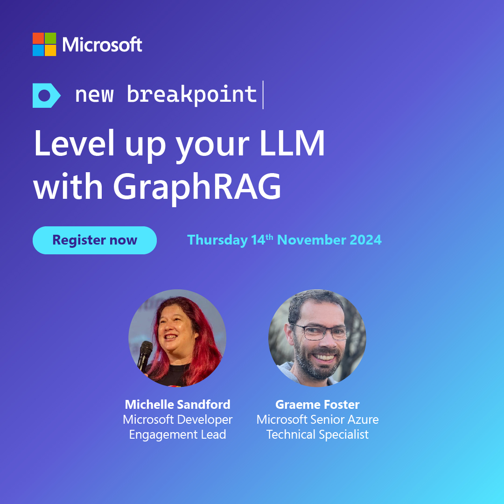

New Breakpoint is a regular online show for Australian, Asian and New Zealand developers produced by local developers at Microsoft and in the community.

This repository hosts useful follow ups, links and other information from each episode.

We want everyone who comes along to feel welcome and safe. Please make sure to review our [Code of Conduct](https://learn.microsoft.com/legal/learnevents/codeofconduct) before joining in and contributing to our discussion.

You can watch all our episodes via playlists on Microsoft ANZ's YouTube Channel - [Season 1](https://aka.ms/new-breakpoint/s1) | [Season 2](https://aka.ms/new-breakpoint/s2) | [Season 3](https://aka.ms/new-breakpoint/s3) 

You can register to view the current season on-demand through our [New Breakpoint Webpage](https://info.microsoft.com/AU-DevEngage-CATALOG-FY22-08Aug-18-New-Breakpoint-SRDEM82686_Catalog-Display-Page.html)

We would like to acknowledge that we record the show on the traditional lands of the Gadigal people of the Eora nation, and have guests from around Australia who join us from the traditional lands of their local people. We pay our respects to Elders past, present and future.

Season 4 kicked off July 2024. You can access it via the on-demand [Season 4](https://aka.ms/new-breakpoint) registration link

[Season 1](https://github.com/ANZAzureDevs/New-Breakpoint/blob/main/series-01.md)
[Season 2](https://github.com/ANZAzureDevs/New-Breakpoint/blob/main/series-02.md)
[Season 3](https://github.com/ANZAzureDevs/New-Breakpoint/blob/main/series-03.md)

***

## 2024-07-11: New Breakpoint S4 Ep 1: Fireside chat with Scott Hunter on .NET Aspire

Join Microsoft Developer Engagement Lead, Michelle Sandford as she chats to Scott Hunter, VP of Product for the Azure Developer Experience Team at Microsoft and learn how this new framework transforms .NET into a modern cloud native framework adding support for Observability, Resiliency, Scalability and Manageability. 

We will cover:

✅ Developer-Centric Insights: Gain valuable insights from Scott Hunter of the Azure developer experience team, as he shares his journey and the evolution of Azure's developer tools and services.

✅ Aspire Framework Introduction: Discover Aspire, the new cloud-native framework for .NET that simplifies the developer experience with built-in defaults for resiliency, health checks, and telemetry. 

✅ Seamless Cloud Transition: Learn how Aspire enables a smooth transition for large enterprise applications to the cloud, enhancing existing features and providing a clear path forward for developers. 

✅ Codespace and GitHub Copilot: Understand how Aspire seamlessly integrates with containers and AI to take away all your complications and speed your developer journey. 

Register to watch on demand: [On demand](https://msevents.microsoft.com/event?id=2397856278)

### Episode Resources:
- [.NET ASPIRE Overview](https://learn.microsoft.com/en-us/dotnet/aspire/get-started/aspire-overview)
- [Introduction to .NET ASPIRE](https://learn.microsoft.com/en-us/training/modules/introduction-dotnet-aspire/)
- [Build Distributed Apps with .NET ASPIRE](https://learn.microsoft.com/en-gb/training/paths/dotnet-aspire/)
- [Tooling to generate AWS deploys from the manifest](https://www.nuget.org/packages/Aspire.Hosting.AWS)
- [code samples using Aspire with OPenAI/Copilot](https://learn.microsoft.com/en-us/dotnet/aspire/azureai/azureai-search-document-component?tabs=dotnet-cli)
- [Add .NET Aspire to an existing .NET App](https://learn.microsoft.com/en-us/dotnet/aspire/get-started/add-aspire-existing-app?tabs=unix&pivots=visual-studio)

If you enjoyed the episode and want more content like it? Try our monthly developer newsletter: [Microsoft Source](https://aka.ms/DevNewsletterJoin)

#MicrosoftAustralia #MicrosoftNZ #MSDeveloperANZ #NewBreakpoint #DevOps #DevSecOps #Azure #GitHub

***

## 2024-08-08: New Breakpoint S4 Ep 2: Simplify cloud-native app deployment and scaling with AKS

Join our host Michelle Sandford, Developer Engagement Lead, as she delves into Azure Kubernetes Service (AKS) with Manoj Ravikumar Nair, Microsoft Azure App Innovation Specialist.

Manoj will show how you can use AKS features to simplify app deployment and automatically scale your applications.

This session is your gateway to building resilient, manageable and scalable cloud-native applications. Discover how AKS facilitates the hosting of cloud-native applications and learn how to package and release your applications seamlessly.

We will cover:

✅ Fundamentals of Kubernetes, AKS and Azure Container Registry (ACR)

✅ Deploying applications using Kubernetes Constructs and the Application Routing add-on

✅ Implementing application updates and rollback strategies 

✅ Scaling applications manually or automatically with Horizontal Pod Autoscaler (HPA) and Vertical Pod Autoscaler (VPA)

Register to watch on demand: [On demand](https://msevents.microsoft.com/event?id=526822164)

### Episode Resources:
- [Learn about Azure Kubernetes Service](https://learn.microsoft.com/en-gb/azure/aks/)
- [Develop on Azure Kubernetes Service (AKS) with Helm](https://learn.microsoft.com/en-us/azure/aks/quickstart-helm?tabs=azure-cli)
- [Cluster operator and developer best practices to build and manage applications on Azure Kubernetes Service (AKS)](https://learn.microsoft.com/en-us/azure/aks/best-practices)
- [Use the cluster autoscaler in Azure Kubernetes Service (AKS)](https://learn.microsoft.com/en-us/azure/aks/cluster-autoscaler?tabs=azure-cli)
- [Upgrade an Azure Kubernetes Service (AKS) cluster](https://learn.microsoft.com/en-us/azure/aks/tutorial-kubernetes-upgrade-cluster?tabs=azure-cli)
- [Episode Q&A](qanda/S04E02LiveQandA.md)

If you enjoyed the episode and want more content like it? Try our monthly developer newsletter: [Microsoft Source](https://aka.ms/DevNewsletterJoin)

#MicrosoftAustralia #MicrosoftNZ #MSDeveloperANZ #NewBreakpoint #DevOps #DevSecOps #Azure #GitHub

***

## 2024-12-09: New Breakpoint S4 Ep3 Code green: the intersection of software engineering and sustainability

Join host Michelle Sandford, Developer Engagement Lead, as she investigates the emerging discipline of green software engineering with Sara Bergman, Senior Software Engineer at Microsoft Norway. 
Sara is an advocate for green software practices, in her role at Microsoft as well as through contributions to the Green Software Foundation and as co-author of the book Building Green Software. 

This episode highlights the importance of considering the environmental impact of software and how you can take steps to mitigate it through green software practices and sustainable development strategies. It provides insights into the intersection of software engineering and sustainability, along with practical tips to get you started:

✅ How you can contribute to green software initiatives within your organisation and community.

✅ The impact of software on hardware requirements and the importance of energy and hardware efficiency.

✅ Practical steps software engineers can take in their work to design and build software with sustainability in mind.

✅ How to engage in advocacy, education and thoughtful design as a practitioner of green software development.

Register to watch on demand: [On demand](https://msevents.microsoft.com/event?id=4006170917)

### Episode Resources:
- [Green Software Foundation](https://greensoftware.foundation/)
- [Green Software Foundation GitHub Page](https://github.com/Green-Software-Foundation)
- [Sustainability from the datacenter to the cloud with Azure](https://www.microsoft.com/en-us/sustainability/azure)
- [Well architected framework - Sustainable Workloads](https://learn.microsoft.com/en-us/azure/well-architected/sustainability/sustainability-get-started)
- [How to architect software for a greener future](https://www.infoq.com/articles/architect-software-for-greener-future/)
- [Building Green Software O'Reilly Book](https://www.oreilly.com/library/view/building-green-software/9781098150617/)

If you enjoyed the episode and want more content like it? Try our monthly developer newsletter: [Microsoft Source](https://aka.ms/DevNewsletterJoin)

#MicrosoftAustralia #MicrosoftNZ #MSDeveloperANZ #NewBreakpoint #GreenSoftware #Sustainability #Azure #Rust

## 2024-10-10: New Breakpoint S4 Ep4 Scale smarter with AI-Sentry, a game-change for enterprise genAI

In this episode, we dive under the hood of Microsoft’s open-sourced solution that helps enterprises scale their generative AI implementations. Microsoft AI Technical Specialist Rivaaj Jumna and Cloud Solution Architect Arian Nevjestic will demonstration how AI-Sentry is a game-changer for enterprises looking to securely scale genAI.

✅ Configuration and setup of AI-Sentry

✅ Scaling AI for Enterprise

Register to watch on demand: [On demand](https://msevents.microsoft.com/event?id=4006170917)

### Episode Resources:
- [AI Sentry](https://github.com/microsoft/ai-sentry)
- [GenAI Gateway](https://learn.microsoft.com/en-us/ai/playbook/technology-guidance/generative-ai/dev-starters/genai-gateway/)
- [APIM Management](https://learn.microsoft.com/en-us/azure/api-management/)

If you enjoyed the episode and want more content like it? Try our monthly developer newsletter: [Microsoft Source](https://aka.ms/DevNewsletterJoin)

#MicrosoftAustralia #MicrosoftNZ #MSDeveloperANZ #NewBreakpoint #GreenSoftware #Sustainability #Azure #Rust

## 2024-10-10: New Breakpoint S4 Ep5 SBeyond BaseRAG: using GraphRAG to get more from your GPT

In this episode of New Breakpoint, Michelle Sandford and Graeme Foster delve deep into the world of RAG. Retrieval augmented generation (RAG) has emerged as a powerful technique for enhancing the capabilities of large language models (LLMs). By combining the strengths of traditional retrieval methods with the generative power of LLMs, RAG enables models to access and incorporate relevant information from external sources, leading to more accurate, informative and contextually relevant responses. But it has presented limitations.

Enter GraphRAG. Join us for a live demonstration of the transformative potential of GraphRAG. Witness its capabilities, learn how it can be applied to various use cases and discover the practical steps to implement this groundbreaking technology in your own projects.

Don’t miss this opportunity to learn:

✅	The challenges and limits of traditional RAG.

✅	The power of knowledge graphs

✅	How GraphRAG leverages knowledge graphs to better understand the relationships between entities in a document, enhancing LLM responses.

✅	How to get started with GraphRAG using the Microsoft SDK.

Whether you’re a seasoned developer or just starting out, this episode will equip you with the knowledge and tools to unlock the full potential of GraphRAG.

Graeme will present insightful examples of how GraphRAG works taking you through its core building blocks. He’ll also provide an overview of the Microsoft SDK that makes it easier to implement GraphRAG.
With pointers to additional resources and research, this engaging episode will get you off and running with a sound understanding of how to implement GraphRAG and what it can help your organisation achieve.

Register to watch on demand: [On demand](https://aka.ma/New-Breakpoint)

### Episode Resources:
- [Microsoft GraphRAG Blog](https://www.microsoft.com/en-us/research/blog/graphrag-unlocking-llm-discovery-on-narrative-private-data/?msockid=04eae7ff00416f3535a2f521011c6eb4)
- [Microsoft GraphRAG on GitHub](https://github.com/microsoft/graphrag)
- [GraphRAG Docs](https://microsoft.github.io/graphrag/)
- [Microsoft GraphRAG Accelerator](https://github.com/Azure-Samples/graphrag-accelerator)

If you enjoyed the episode and want more content like it? Try our monthly developer newsletter: [Microsoft Source](https://aka.ms/DevNewsletterJoin)

#MicrosoftAustralia #MicrosoftNZ #MSDeveloperANZ #NewBreakpoint #GreenSoftware #Sustainability #Azure #Rust

